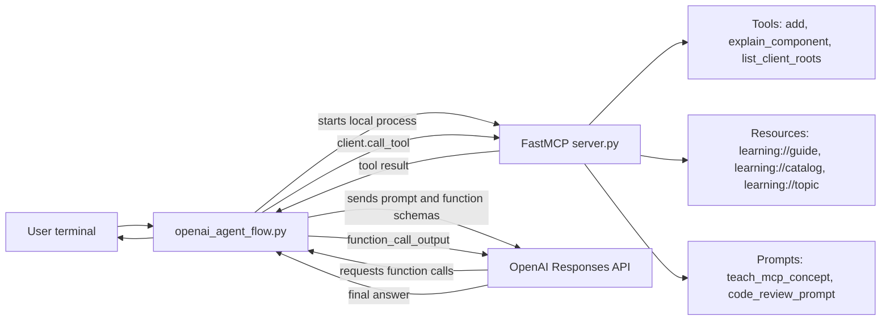
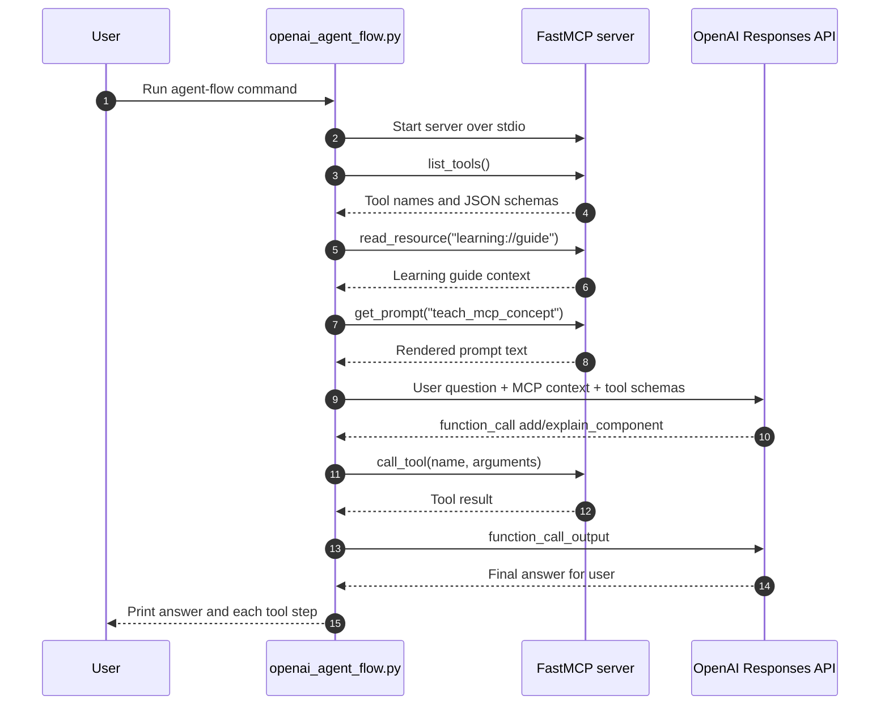

# FastMCP OpenAI Learning Repo

Beginner-friendly reference repo for building an MCP server and clients with
[FastMCP](https://gofastmcp.com/getting-started/welcome).

It includes local `stdio` and HTTP transports, tools, resources, resource
templates, prompts, client roots, elicitation, and OpenAI-backed MCP sampling.

## What You Will Learn

- How to expose Python functions as MCP tools.
- How to expose read-only context with resources and resource templates.
- How to publish reusable prompt templates.
- How a client can provide roots to a server.
- How a server can ask the user for missing information with elicitation.
- How a server can request an LLM answer through MCP sampling.
- How to run the same server locally over `stdio` or remotely over HTTP.

## Project Structure

```text
.
├── .env.example
├── pyproject.toml
├── README.md
├── src/fastmcp_learning/
│   ├── server.py
│   └── clients/
│       ├── common.py
│       ├── openai_agent_flow.py
│       ├── stdio_client.py
│       └── http_client.py
└── tests/
    ├── test_openai_agent_flow.py
    └── test_server.py
```

## Setup

Create and activate a virtual environment if you want to keep dependencies
isolated:

```bash
python -m venv .venv
source .venv/bin/activate
```

Install the repo:

```bash
python -m pip install -e ".[dev]"
```

Optional OpenAI setup:

```bash
cp .env.example .env
export OPENAI_API_KEY="your_openai_api_key_here"
export OPENAI_MODEL="gpt-5.2"
```

The non-LLM examples run without an OpenAI key. The `ask_llm` example uses MCP
sampling and needs `OPENAI_API_KEY`.

## How The Pieces Connect



## Run The OpenAI Agent Flow

This example shows the flow most people mean when they ask, "How does an LLM use
my MCP server?"

```bash
python -m fastmcp_learning.clients.openai_agent_flow
```

What happens:

1. The client starts the FastMCP server locally over `stdio`.
2. The client lists the MCP tools exposed by the server.
3. The client converts selected MCP tools into OpenAI function tools.
4. The client reads an MCP resource and renders an MCP prompt for extra context.
5. OpenAI decides which MCP tools to call.
6. The client runs those tool calls against the MCP server.
7. Tool results are sent back to OpenAI.
8. OpenAI writes the final answer.



Try your own task:

```bash
python -m fastmcp_learning.clients.openai_agent_flow \
  --question "Use MCP tools to explain resources and calculate 8 + 13"
```

This demo exposes only the safe automatic tools: `add`, `explain_component`, and
`list_client_roots`. The server also has interactive examples like elicitation
and sampling, but those are easier to understand after the basic tool-call loop.

## Run Locally With Stdio

This launches the server as a subprocess and talks to it through standard input
and output:

```bash
python -m fastmcp_learning.clients.stdio_client
```

The stdio client demonstrates:

- listing tools, resources, and prompts
- calling `add`
- reading `learning://guide`
- reading the template URI `learning://topic/resources?detail=long`
- rendering `teach_mcp_concept`
- passing a project root to the server
- answering an elicitation request
- optionally calling OpenAI through MCP sampling

## Run Over HTTP

Terminal 1:

```bash
python -m fastmcp_learning.server --transport http --host 127.0.0.1 --port 8000
```

Terminal 2:

```bash
python -m fastmcp_learning.clients.http_client
```

The HTTP MCP endpoint is:

```text
http://127.0.0.1:8000/mcp
```

You can point the HTTP client somewhere else:

```bash
python -m fastmcp_learning.clients.http_client --url http://127.0.0.1:9000/mcp
```

## What Is In The Server?

`src/fastmcp_learning/server.py` has one small example for each MCP concept:

- `add`: simple tool with typed inputs and structured output.
- `explain_component`: tool with constrained input values.
- `list_client_roots`: shows roots provided by the client.
- `plan_learning_project`: demonstrates elicitation.
- `ask_llm`: demonstrates MCP sampling through the client's OpenAI handler.
- `learning://guide`: static resource.
- `learning://catalog`: JSON resource.
- `learning://topic/{topic}{?detail}`: resource template.
- `teach_mcp_concept`: reusable prompt template.
- `code_review_prompt`: second prompt template for comparison.

## Run Tests

```bash
python -m pytest
```

## Add Your GitHub Remote Later

When you send the GitHub repo URL, use:

```bash
git remote add origin YOUR_GITHUB_REPO_URL
git push -u origin main
```

## References

- FastMCP welcome: https://gofastmcp.com/getting-started/welcome
- FastMCP server transports: https://gofastmcp.com/deployment/running-server
- FastMCP client transports: https://gofastmcp.com/clients/transports
- FastMCP sampling: https://gofastmcp.com/clients/sampling
- FastMCP elicitation: https://gofastmcp.com/clients/elicitation
- OpenAI API quickstart: https://platform.openai.com/docs/quickstart?api-mode=responses&lang=python
